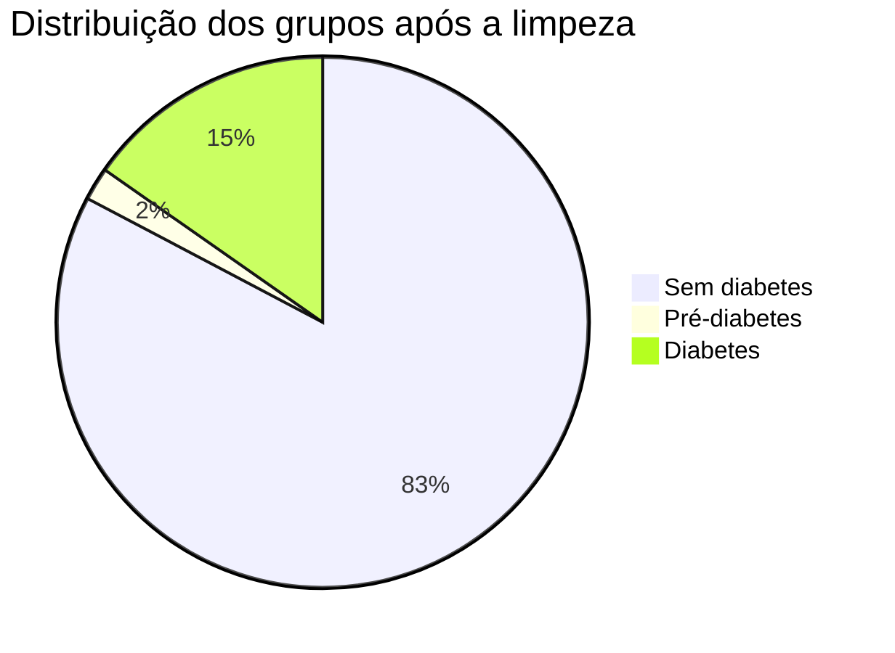
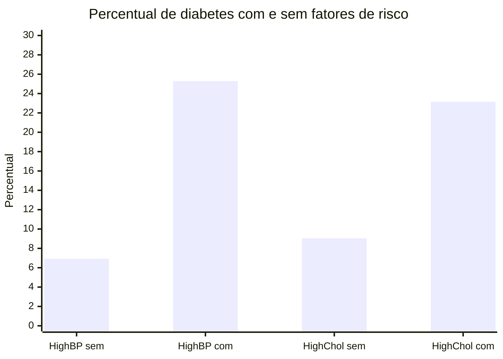

# Projeto de Estatística

Análise exploratória de dados sobre diabetes nos Estados Unidos com base no dataset `BRFSS 2015`.

## Objetivo

O objetivo deste projeto é investigar quais fatores de saúde e estilo de vida aparecem mais associados ao diabetes.

Ao longo da análise, o notebook busca responder quatro perguntas principais:

1. Quais fatores de risco estão mais relacionados ao diabetes?
2. Qual a relação entre IMC, atividade física e diabetes?
3. Qual a relação entre renda, educação e diabetes?
4. Qual a relação entre sexo, renda e diabetes?

## Estrutura principal

Na raiz do projeto ficam apenas os arquivos principais:

- `PROJETO_ESTATISTICA.ipynb`: notebook principal da análise
- `README.md`: visão geral do projeto
- `.gitignore`: regras para ignorar arquivos temporários e auxiliares

## Visão rápida da base

| Indicador | Valor |
|---|---:|
| Registros originais | 253.680 |
| Duplicatas removidas | 23.899 |
| Registros após limpeza | 229.781 |
| Sem diabetes | 82,71% |
| Pré-diabetes | 2,01% |
| Diabetes | 15,27% |

## Sobre a análise

O notebook realiza:

- carregamento da base
- verificação de valores nulos
- identificação e remoção de duplicatas
- conversão de tipos numéricos
- criação de variável auxiliar para diabetes
- medidas de centralização, posição e dispersão
- correlação de Pearson
- normalização Min-Max do IMC
- visualizações para apoiar as hipóteses

## Destaques da análise

| Hipótese | Resultado principal | Leitura final |
|---|---|---|
| Fatores de risco | Pressão alta: 6,93% → 25,29% | Confirmada |
| Fatores de risco | Colesterol alto: 9,04% → 23,15% | Confirmada |
| IMC e atividade física | IMC médio cresce de 28,03 para 31,96 | Confirmada |
| Renda e educação | Menor renda: 24,34% / Maior renda: 9,81% | Confirmada como tendência geral |
| Sexo e renda | Na menor renda, feminino 25,84% e masculino 21,18% | Não confirmada na forma proposta |

## Principais interpretações

- Pressão alta e colesterol alto apareceram com associação clara ao diabetes.
- O IMC médio cresce conforme o grupo avança de sem diabetes para diabetes.
- A prática de atividade física é menor nos grupos com diabetes.
- Faixas mais baixas de renda e escolaridade apresentaram percentuais maiores de diabetes.
- A hipótese de que homens de baixa renda teriam mais diabetes não se confirmou na menor faixa de renda.

## Como abrir

Abra o arquivo `PROJETO_ESTATISTICA.ipynb` no Jupyter Notebook, JupyterLab ou Google Colab e execute as células em ordem.

## Observação

O projeto é exploratório. Por isso, os resultados devem ser interpretados como associação entre variáveis, e não como prova de causalidade.
